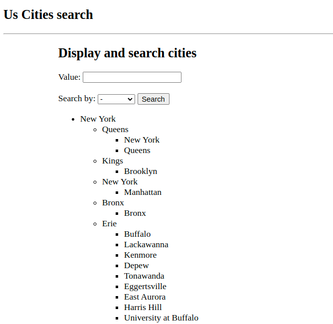

# US cities search

## Installation and run

Application is fully dockerized:

* Build docker image: ```docker compose build```

* Start application: ```docker compose up -d```

* Open application on http://127.0.0.1:5000/ 

* Stop application: ```docker compose down```

## Description

Application is build on [Flask](https://flask.palletsprojects.com/en/2.2.x/) web application framework.
App uses PostgreSQL as database and [psycopg2](https://www.psycopg.org/) library as client for the database.

I have tried to keep application lightweight as possible, so I haven't used any other sophisticated library.
* Manipulation with database is done directly via SQL.
* The python csv module parses CSV file in application, but I use the Pandas library to work with csv files and tabular data mostly.
* The algorithm to process tabular data into tree structure is done by putting states, countries and cities into dictionary. 
Complexity of the solution should be O(1), 
but there is no clear definition what is complexity of operation `dict.get(key)`. Most of the posts indicate about O(1) complexity.

Application has simple UI:
* Load csv file

* Display and search cities
